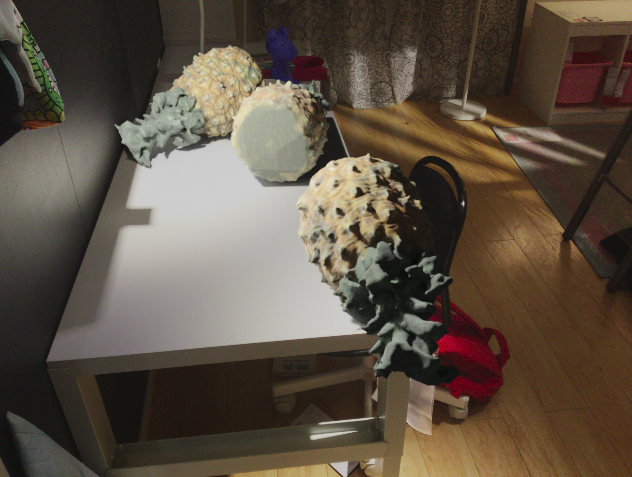
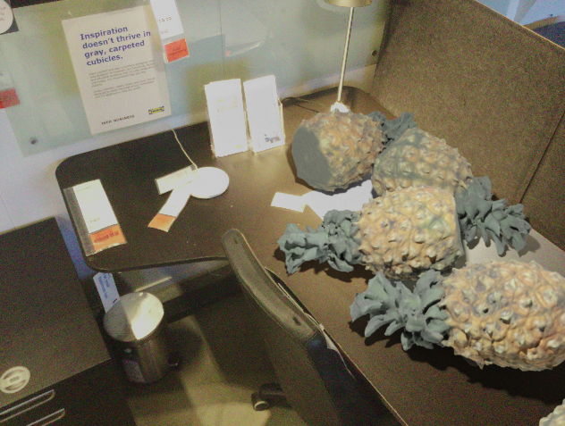
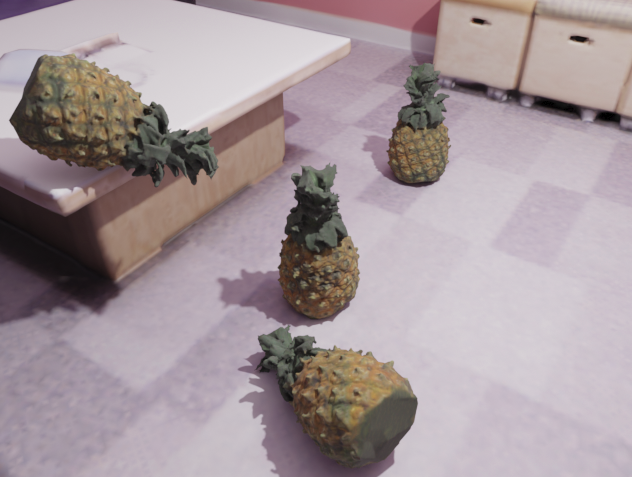
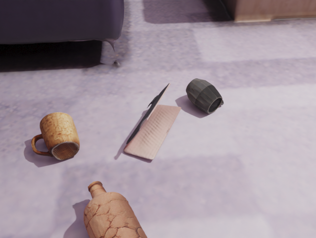
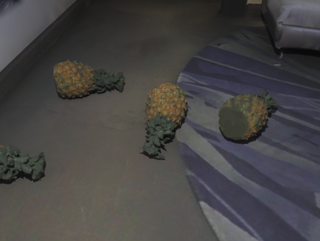
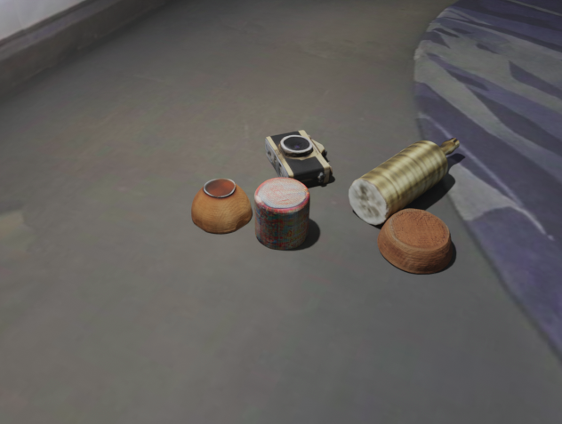

<div align="center">

# Omni6DPose: create a realistic synthetic dataset

</div>

The goal of our project was to reproduce the current way of generating synthetic data for computer vision and the method used in the [Omni6DPose](https://jiyao06.github.io/Omni6DPose/) and of the [Omni6D](https://github.com/3DTopia/Omni6D) project as the basis for our work. 

## Installation & Setup

Before start install a suitable version of [BlenderProc](https://github.com/DLR-RM/BlenderProc)
```
git clone git@github.com:3DTopia/Omni6D.git
cd Omni6D
pip install blenderproc 
```
If you are going to use any of the files `dataset/dataset.py`, `dataset/dataset_new_obj.py`, `dataset/dataset_Matterport.py`, `dataset/dataset_Matterport_custom_obj.py`, `dataset/dataset_Ikea.py`, then update the following in it (what these files are for is explained below):
 - Change the path in `--output_dir` to the path to your output folder. 
 - Change the path in `--scene` to the path to your scene dataset.
    
    The scenes can be downloaded from [Replica-Dataset](https://github.com/facebookresearch/Replica-Dataset), [IKEA background](https://github.com/hughw19/NOCS_CVPR2019?tab=readme-ov-file#datasets), [Matterport3D dataset](https://dlr-rm.github.io/BlenderProc/examples/datasets/matterport3d/README.html).
  - Change the path for the `--objects` variable to the path to objects.
  
    For constructing your own dataset with real-scanned object meshes, you can make use of [OmniObject3D](https://github.com/omniobject3d/OmniObject3D), which includes a significant portion of our object meshes.

## Reproducing Omni6DPose with the IKEA dataset
`dataset_Ikea.py` is a modified version of the Omni6D script made to work with the IKEA dataset. Here are the main changes we made:
- It loads scenes with 3D models of tables and realistic background images from the IKEA dataset.
- Instead of placing cameras randomly, we use predefined camera positions from the dataset. This makes sure the background matches the camera view during rendering.
- Objects are placed using ray tracing from the camera to find horizontal surfaces, so they are placed naturally.
- The rendering uses a transparent scene that keeps shadows, which are then added to real background photos. Each camera position uses the matching room image from the dataset.

To run the script and reproduce our results, use the following command:

```
blenderproc run dataset/dataset_Ikea.py
```

You can also change the value of `pic_num` to use a different number of camera positions during rendering. If pic_num is greater than the total number of available positions, all camera positions will be used instead (pic_num will be set to the maximum number).

The `--setShadows` variable enables or disables shadow rendering in a scene. When shadows are enabled, the room acts as a shadow catcher, when disabled, the room does not receive shadows and does not affect the final image.

Some results for the dataset IKEA with and without rendered shadows:

<p align="center">
  
  
</p>

## Adapting Omni6D for Replica and Matterport datasets

To reproduce our results using the Replica or Matterport scenes, run one of the following commands:

```
blenderproc run dataset/dataset.py
```
```
blenderproc run dataset/dataset_new_obj.py
```
```
blenderproc run dataset/dataset_Matterport.py
```
```
blenderproc run dataset/dataset_Matterport_custom_obj.py
```
### Matterport Dataset
These scripts are used to generate scenes based on the Matterport dataset.
- `dataset_Matterport.py` uses object models from the OmniObject3D dataset.
- `dataset_Matterport_custom_obj.py` uses custom object models.

### Replica Dataset
- `dataset.py` uses object models from OmniObject3D.
- `dataset_new_obj.py` uses custom object models.

These scripts are used to generate scenes based on the Replica dataset.
We also experimented with stereo matching in `dataset.py`, but the results were less accurate than the default depth maps generated by the default camera.

Some results for the dataset Replica with object from the OmniObject3D and custom objects:

<p align="center">
  
  
</p>

Some results for the dataset Matterport with object from the OmniObject3D and custom objects:

<p align="center">
  
  
</p>


<div align="center">
